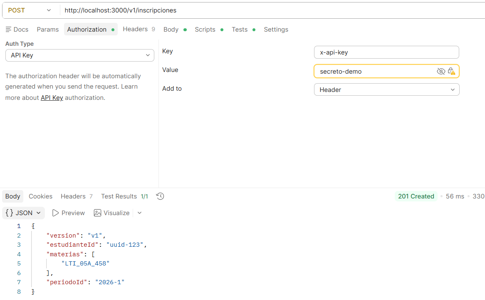
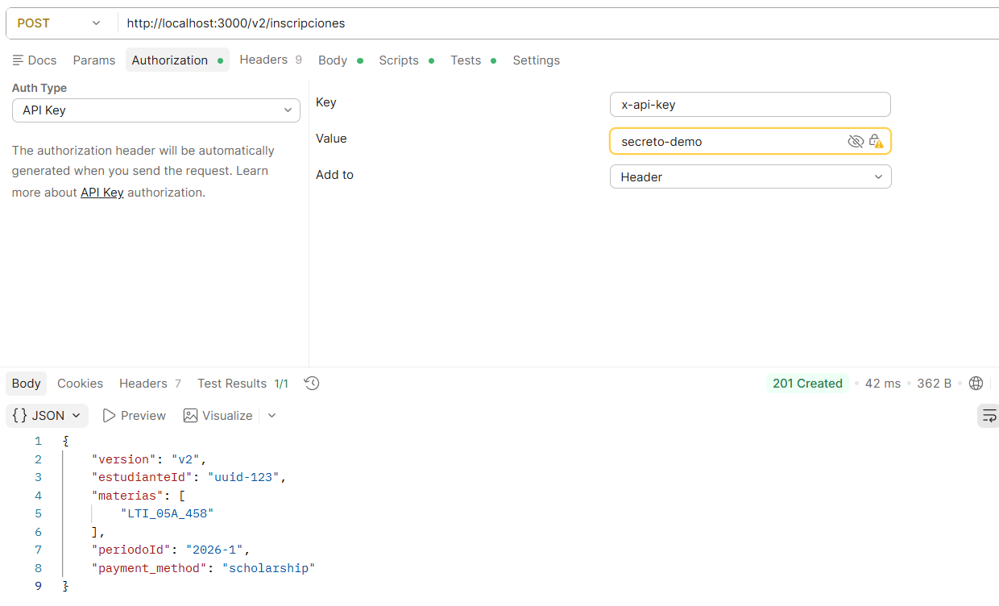
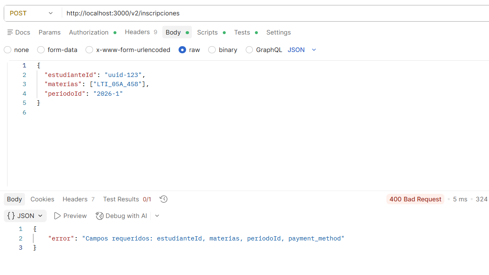
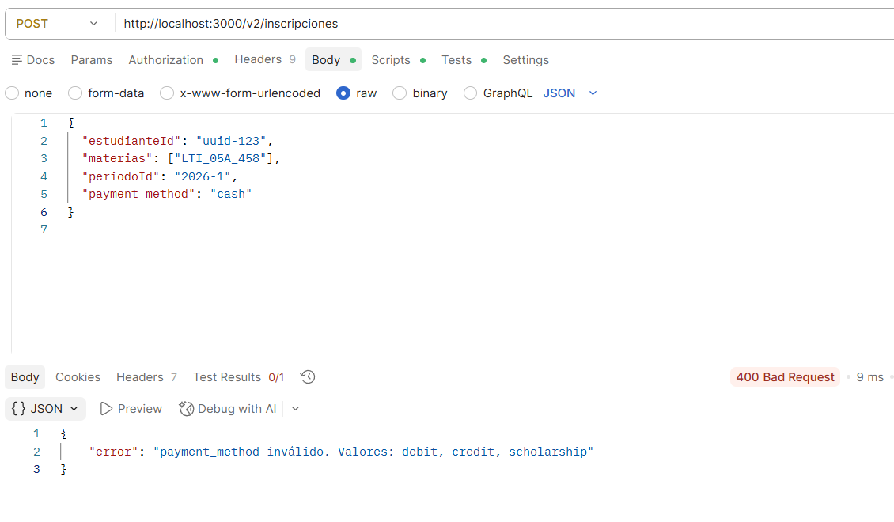
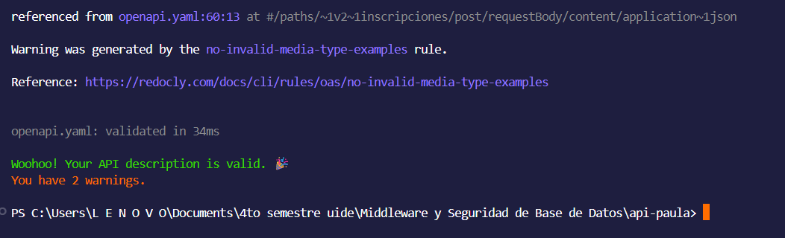

# Pruebas de la API

## Escenario 1: solicitud sin API key -> esperado: 401

Comando:
curl.exe http://localhost:3000/health 

Salida:
{"error":"API key inválida o ausente"}

Explicación:
El servidor rechaza la solicitud porque no se envió la API key requerida y devuelve un código de estado 401 Unauthorized.

## Escenario 2: solicitud con clave válida -> esperado: 200

Comando:
curl.exe -H "x-api-key: secreto-demo" http://localhost:3000/health

Salida:
{"status":"ok","ts":"2026-06-12T02:13:10.635Z"}

Explicación:
El servidor acepta la solicitud porque la API key es correcta y devuelve un código de estado 200 OK.

## Escenario 3: ruta inexistente -> esperado: 404

Comando:
curl.exe -H "x-api-key: secreto-demo" http://localhost:3000/noexiste

Salida:
{"error":"Ruta no encontrada"}

Explicación:
La solicitud contiene una API key válida, pero la ruta no existe, por lo que el servidor devuelve un código de estado 404 Not Found.

## TESTING

Para ejecutar las pruebas unitarias del proyecto se utiliza el siguiente comando:

npm test

Salida obtenida:

> api-paula@1.0.0 test
> node --experimental-vm-modules node_modules/jest/bin/jest.js

(node:16900) ExperimentalWarning: VM Modules is an experimental feature and might change at any time
(Use `node --trace-warnings ...` to show where the warning was created)
 PASS  src/middlewares/logger.test.ts
  requestLogger
    √ debe llamar a next() al recibir una petición (2 ms)
    √ debe registrar el método y la ruta correctamente (1 ms)

Test Suites: 1 passed, 1 total
Tests:       2 passed, 2 total
Snapshots:   0 total
Time:        0.305 s, estimated 1 s
Ran all test suites.
PS C:\Users\L E N O V O\Documents\api-paula> npm test

> api-paula@1.0.0 test
> node --experimental-vm-modules node_modules/jest/bin/jest.js

(node:31740) ExperimentalWarning: VM Modules is an experimental feature and might change at any time
(Use `node --trace-warnings ...` to show where the warning was created)
 PASS  src/middlewares/auth.test.ts
 PASS  src/middlewares/logger.test.ts

Test Suites: 2 passed, 2 total
Tests:       5 passed, 5 total
Snapshots:   0 total
Time:        0.412 s, estimated 1 s
Ran all test suites.

Los resultados muestran que los cinco casos de prueba fueron ejecutados correctamente, verificando el funcionamiento del 
middleware de registro de peticiones y del verificador de API key sin necesidad de levantar el servidor.

## Pruebas de los endpoints

Servidor corriendo en `http://localhost:3000`. Autenticacion: header `x-api-key: secreto-demo`.

### Escenario 1 — POST /v1/inscripciones con campos válidos (esperado: 201)

### Escenario 2 — POST /v2/inscripciones con payment_method válido (esperado: 201)

### Escenario 3 — POST /v2/inscripciones sin payment_method (esperado: 400)

### Escenario 4 — POST /v2/inscripciones con payment_method inválido (esperado: 400)

## Validación del contrato OpenAPI

Se ejecutó el comando `npx @redocly/cli lint openapi.yaml` para validar el contrato OpenAPI. El resultado final no presenta ningún error, por lo que el documento cumple con la estructura esperada.

## Reflexión sobre el contrato

En caso de que otro equipo empezara a consumir mi API mañana o en el futuro, mejoraría el contrato OpenAPI añadiendo descripciones más detalladas en cada endpoint, ejemplos completos de respuestas exitosas y de error, y, también, códigos http de estado más específicos para cada caso. Así mismo, incluiría un esquema estándar para los errores, con el fin de que todos los consumidores reciban respuestas informativas y completas. Por último, mantendría la estrategia de versionado con las rutas `/v1/` y `/v2/`, evitando así cambios incompatibles en versiones que ya se han publicado y docuentando de manera clara las diferencias entre cada versión del contrato.
